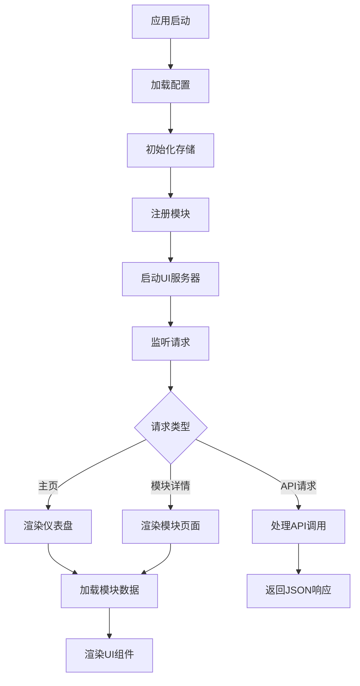
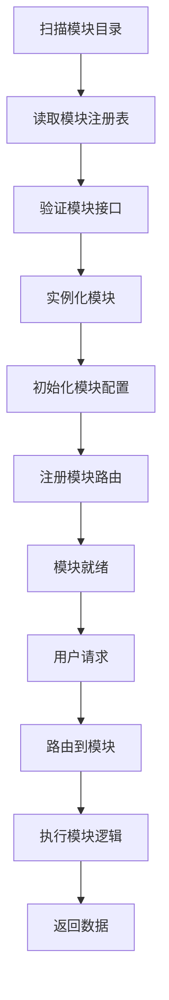
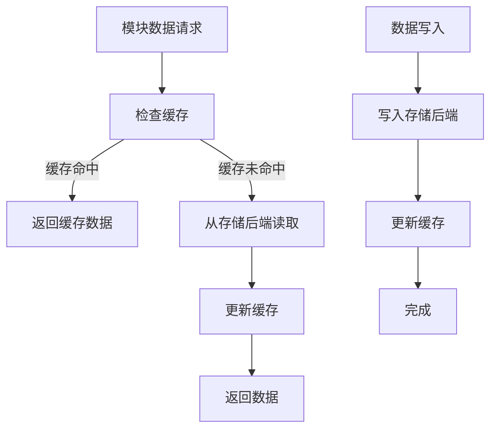

# 系统架构设计

## 架构概览

Modular Dashboard 采用分层模块化架构，通过清晰的职责分离和接口抽象，实现高度的可扩展性和可维护性。整个系统分为五个主要层次：

```
┌─────────────────────────────────────────────────────────────┐
│                    用户界面层 (UI Layer)                      │
├─────────────────────────────────────────────────────────────┤
│                    业务逻辑层 (Business Logic)               │
├─────────────────────────────────────────────────────────────┤
│                    模块系统层 (Module System)                 │
├─────────────────────────────────────────────────────────────┤
│                    数据访问层 (Data Access)                   │
├─────────────────────────────────────────────────────────────┤
│                    基础设施层 (Infrastructure)                 │
└─────────────────────────────────────────────────────────────┘
```

## 核心设计原则

### 1. 模块化设计 (Modularity)
- **插件化架构**：每个功能模块都是独立的插件，可以动态加载和卸载
- **接口标准化**：统一的模块接口，确保模块间的互操作性
- **松耦合**：模块间通过标准接口通信，减少直接依赖

### 2. 分层架构 (Layered Architecture)
- **职责分离**：每层都有明确的职责，避免功能混杂
- **依赖单向**：上层依赖下层，下层不依赖上层
- **接口抽象**：层间通过抽象接口通信，实现细节隐藏

### 3. 配置驱动 (Configuration-Driven)
- **外部化配置**：所有配置信息存储在外部文件中
- **运行时配置**：支持配置的动态加载和更新
- **环境适配**：根据运行环境自动调整配置

### 4. 可扩展性 (Extensibility)
- **插件机制**：支持第三方模块的开发和集成
- **事件系统**：模块间通过事件进行松耦合通信
- **钩子机制**：提供扩展点供自定义功能实现

## 详细架构设计

### 1. 用户界面层 (UI Layer)

**职责**：负责用户交互和界面展示

**核心组件**：
- **Dashboard UI** (`ui/dashboard.py`)：主界面渲染和布局管理
- **Layout Manager** (`ui/layout.py`)：页面布局和响应式设计
- **Module Cards** (`ui/module_card.py`)：模块卡片组件
- **Navigation** (`ui/header.py`)：导航和菜单组件
- **FAB** (`ui/fab.py`)：浮动操作按钮

**技术栈**：
- **NiceGUI**：现代 Python UI 框架
- **响应式设计**：支持多种屏幕尺寸
- **主题系统**：亮色/暗色主题切换

### 2. 业务逻辑层 (Business Logic)

**职责**：处理核心业务逻辑和流程控制

**核心组件**：
- **Application Core** (`app.py`)：应用生命周期管理
- **Configuration Manager** (`config/manager.py`)：配置文件管理
- **Route Handler**：URL 路由和页面导航
- **Event System**：事件分发和处理

**设计特点**：
- **依赖注入**：通过依赖注入管理组件生命周期
- **中间件模式**：支持请求处理的中间件链
- **状态管理**：统一的应用状态管理

### 3. 模块系统层 (Module System)

**职责**：模块的加载、管理和执行

**核心组件**：
- **Module Base** (`modules/base.py`)：模块基类定义
- **Extended Module** (`modules/extended.py`)：扩展功能模块基类
- **Module Registry** (`modules/registry.py`)：模块注册和发现
- **Module Loader**：动态模块加载器

**模块类型**：
- **数据源模块**：ArXiv、GitHub、RSS 等
- **工具模块**：时钟、天气、待办事项等
- **监控模块**：系统监控、网站监控等
- **娱乐模块**：动物图片、随机内容等

### 4. 数据访问层 (Data Access)

**职责**：数据的存储、缓存和检索

**核心组件**：
- **Storage Manager** (`storage.py`)：存储管理器
- **Storage Backends**：多种存储后端实现
- **Cache System**：缓存机制和 TTL 管理
- **Data Validation**：数据验证和转换

**存储后端**：
- **JSON File Backend**：JSON 文件存储
- **Pickle File Backend**：Pickle 文件存储
- **Memory Backend**：内存存储
- **Cached Storage**：带缓存的存储包装器

### 5. 基础设施层 (Infrastructure)

**职责**：提供基础服务和工具支持

**核心组件**：
- **Logger** (`utils/logger.py`)：日志系统
- **HTTP Client**：网络请求客户端
- **Scheduler**：任务调度器
- **File System**：文件系统操作

## 数据流设计

### 1. 应用启动流程



### 2. 模块加载流程



### 3. 数据存储流程



## 模块架构详解

### 模块基类设计

所有模块都继承自 `Module` 基类，必须实现以下核心接口：

```python
class Module(ABC):
    @property
    @abstractmethod
    def id(self) -> str: pass
    
    @property
    @abstractmethod
    def name(self) -> str: pass
    
    @property
    @abstractmethod
    def icon(self) -> str: pass
    
    @property
    @abstractmethod
    def description(self) -> str: pass
    
    @abstractmethod
    def fetch(self) -> list[dict[str, Any]]: pass
    
    @abstractmethod
    def render(self) -> None: pass
```

### 扩展模块功能

`ExtendedModule` 提供了更多高级功能：

- **异步支持**：`async_fetch()` 方法
- **重试机制**：`fetch_with_retry()` 方法
- **错误处理**：统一的错误处理和恢复
- **统计信息**：模块使用统计和监控
- **数据导入导出**：支持多种数据格式

### 模块注册机制

模块通过注册表进行统一管理：

```python
MODULE_REGISTRY = {
    "arxiv": ArxivModule,
    "github": GithubModule,
    "rss": RssModule,
    # ... 更多模块
}
```

## 配置系统架构

### 配置层次结构

```json
{
  "version": "0.1.0",
  "theme": "light",
  "layout": {
    "columns": 3,
    "width": "default",
    "show_nav": true,
    "column_config": [...]
  },
  "modules": [
    {
      "id": "arxiv",
      "enabled": true,
      "config": {...}
    }
  ]
}
```

### 配置管理流程

1. **配置加载**：从系统配置目录读取配置文件
2. **配置验证**：验证配置格式和必需字段
3. **配置合并**：合并默认配置和用户配置
4. **配置分发**：将配置分发给各个模块
5. **配置更新**：支持配置的动态更新

## 存储系统架构

### 存储后端抽象

```python
class StorageBackend(ABC):
    @abstractmethod
    def get(self, key: str, default: Any = None) -> Any: pass
    
    @abstractmethod
    def set(self, key: str, value: Any) -> None: pass
    
    @abstractmethod
    def delete(self, key: str) -> bool: pass
    
    @abstractmethod
    def exists(self, key: str) -> bool: pass
    
    @abstractmethod
    def clear(self) -> None: pass
```

### 缓存机制

- **TTL 支持**：基于时间的缓存过期
- **多层缓存**：内存缓存 + 持久化缓存
- **缓存清理**：自动清理过期缓存项
- **缓存统计**：缓存命中率和性能统计

## 性能优化设计

### 1. 懒加载机制
- 模块按需加载，减少启动时间
- UI 组件延迟渲染，提高响应速度

### 2. 缓存策略
- 数据缓存减少外部 API 调用
- 模板缓存提高渲染性能
- 配置缓存减少文件 I/O

### 3. 异步处理
- 支持异步数据获取
- 非阻塞 UI 更新
- 后台任务处理

### 4. 资源管理
- 内存使用监控和限制
- 文件句柄管理
- 网络连接池

## 安全设计

### 1. 输入验证
- 所有用户输入都经过验证
- 防止注入攻击
- 数据类型检查

### 2. 权限控制
- 文件系统访问权限
- 网络请求限制
- 模块权限隔离

### 3. 数据保护
- 敏感数据加密存储
- 安全的配置文件处理
- 日志数据脱敏

## 扩展性设计

### 1. 插件系统
- 动态模块加载
- 插件生命周期管理
- 插件间通信机制

### 2. 事件系统
- 模块间事件通信
- 全局事件总线
- 事件监听和触发

### 3. 钩子机制
- 预定义扩展点
- 自定义钩子函数
- 插件间功能扩展

## 监控和诊断

### 1. 日志系统
- 结构化日志记录
- 日志级别管理
- 日志文件轮转

### 2. 性能监控
- 模块加载时间
- 数据获取延迟
- 内存使用情况

### 3. 错误处理
- 统一错误处理机制
- 错误恢复策略
- 用户友好的错误提示

## 部署架构

### 1. 开发环境
- 热重载支持
- 调试工具集成
- 开发配置

### 2. 生产环境
- 性能优化
- 安全加固
- 监控告警

### 3. 容器化部署
- Docker 支持
- Kubernetes 部署
- 配置管理

## 总结

Modular Dashboard 的架构设计体现了现代软件工程的最佳实践：

- **模块化**：高度模块化的设计支持灵活的功能扩展
- **可扩展性**：通过插件系统和事件机制支持第三方开发
- **可维护性**：清晰的分层架构和接口抽象
- **性能**：多层缓存和异步处理确保良好的用户体验
- **安全**：全面的安全设计和数据保护机制

这种架构设计使得系统能够适应不断变化的需求，同时保持稳定性和可维护性。